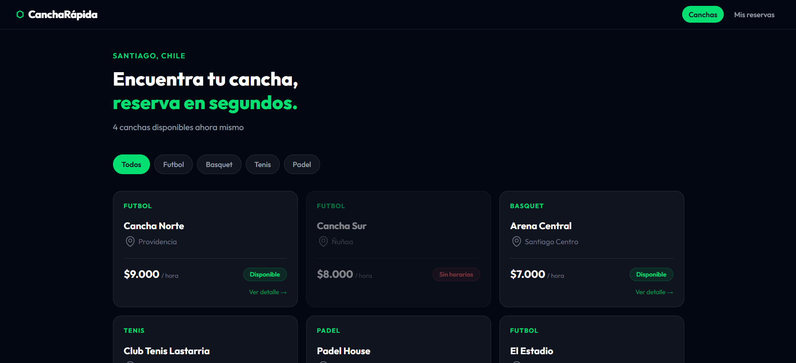
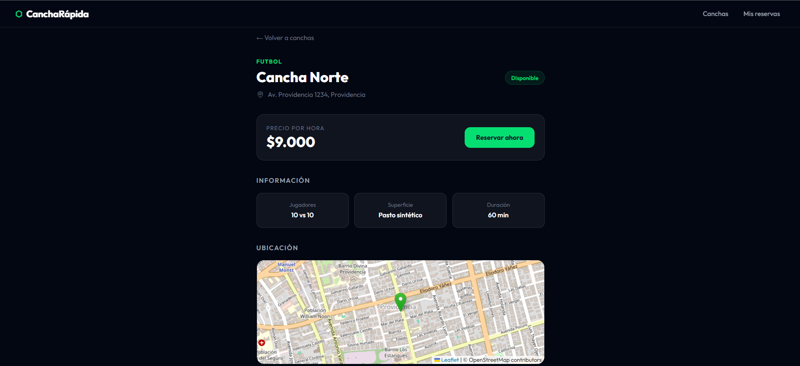
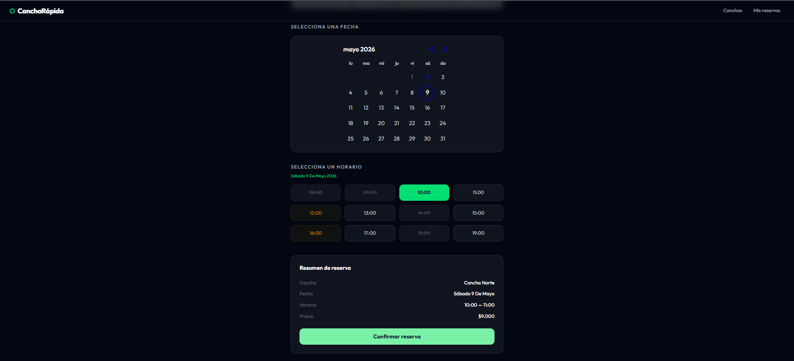
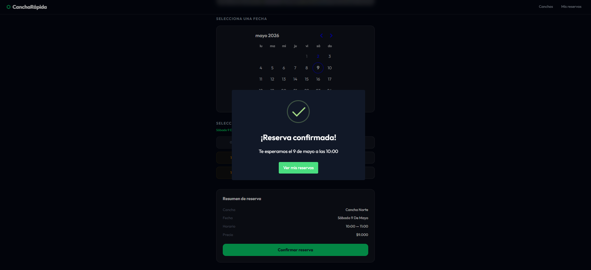
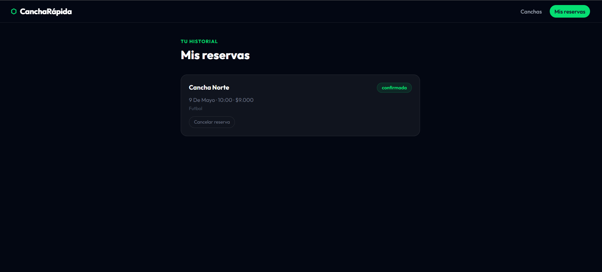

# Cancha Rápida

Sports court booking platform for Santiago, Chile. Built as a full-stack SaaS with multi-role authentication and admin panel.

## Live Demo

[cancha-rapida.vercel.app](https://cancha-rapida.vercel.app)

## Tech Stack

- React 19 + Vite
- Tailwind CSS v4
- React Router v7
- Supabase (PostgreSQL + Auth + RLS)
- Leaflet / OpenStreetMap
- SweetAlert2
- FullCalendar
- date-fns

## Features

### User
- Onboarding screen on first visit
- Email authentication with registration and login
- Court listing with filters by sport
- Court detail page with interactive map
- Date and time slot selection with real availability
- Booking confirmation and cancellation
- Personal booking history
- Profile page with name editing

### Admin
- Protected admin panel by role
- Dashboard with real metrics
- Full bookings table with user and court info
- Weekly and monthly calendar view
- Court management with sede assignment
- Sede management
- User directory

### Technical
- Row Level Security on all tables
- Multi-tenant architecture (superadmin / admin / user)
- Mobile-first responsive design
- Skeleton loading states
- Custom 404 page

## Getting Started

```bash
npm install
npm run dev
```

## Environment Variables

```
VITE_SUPABASE_URL=your_supabase_url
VITE_SUPABASE_KEY=your_publishable_key
```

## Screenshots






